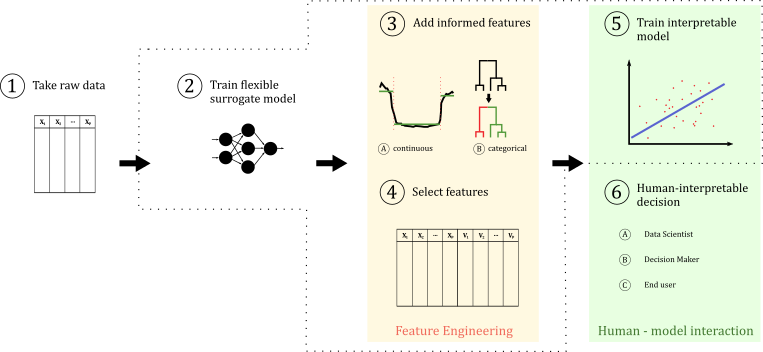

This repository is a landing page for  the article: [Alicja Gosiewska](https://www.linkedin.com/in/alicja-gosiewska/), [Anna Kozak](https://www.linkedin.com/in/kozakanna/), and [Przemysław Biecek](https://www.linkedin.com/in/pbiecek/). *Simpler is Better: Lifting Interpretability-Performance Trade-off via Automated Feature Engineering*. 


# Abstract 

*Machine learning is proved in many areas to generate useful predictive models that can and should support decision-makers. The availability of tools for AutoML makes it possible to quickly create an effective but complex predictive model. However, the complexity of the models is often a major obstacle in applications, especially for high-stake decisions. We are experiencing a growing number of examples where the use of black boxes leads to decisions that are harmful, unfair, or simply wrong. In this paper, we show that very often we can simplify complex models without compromising their performance. However, with the benefit of much needed transparency.*

*We propose a method that uses elastic black-boxes as surrogate models to create simpler, less opaque, yet still accurate and interpretable glass-box models. New models are created using newly engineered features extracted with the help of a surrogate model. We supply the analysis by a large-scale benchmark on several tabular data sets from the OpenML database. There are two results 1) we show that extracting information from complex models may improve the performance of simpler models, 2) we question a common myth that complex predictive models outperform simpler predictive models, 3) we present a real-life application of the proposed method.*

# Proposed method

An important part of our article is  six-step SAFE ML framework. The framework is a fully automatic process starting from raw data and ending with an interpretable model. The main idea is to use complex models to produce new features that are later used to fit interpretable model. The SAFE feature engineering method is flexible and model agnostic, any class of models may be used as a surrogate model and as a glass-box model. Therefore, a surrogate model may be selected to fit the data as best as possible, while glass-box model one can be selected according to the particular task or abilities of the end-users to interpreting models. 



# Use case

[Link to code](https://github.com/agosiewska/SAFE-experiments/tree/master/use-case)

# Benchmark

[Link to code](https://github.com/agosiewska/SAFE-experiments/tree/master/benchmark)


# Preprint

Preprint for this work is avaliable at https://arxiv.org/abs/2002.04267.

In order to cite our work please use the following BiBTeX entry


```
@article{safe,
Author = {Alicja Gosiewska and Przemyslaw Biecek},
Title = {Lifting Interpretability-Performance Trade-off via Automated Feature Engineering},
Year = {2020},
Eprint = {arXiv:2002.04267},
URL={https://arxiv.org/abs/2002.04267}
}
```
